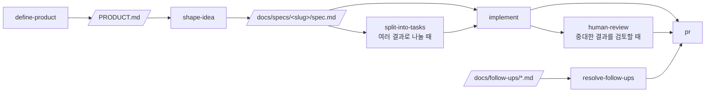

# Claude Code Playbook Template

[](https://www.claude-hunt.com)
[](https://docs.claude-hunt.com)

> [Claude Hunt](https://www.claude-hunt.com) 강의용 Next.js 16 + React 19 템플릿.
> 사용법과 워크플로우 문서는 [docs.claude-hunt.com](https://docs.claude-hunt.com)에서 확인하세요.

## 기술 스택

Next.js 16 (App Router) · React 19 · Tailwind CSS 4 · shadcn/ui · Bun · Vitest · Playwright

## 시작하기

### 사전 준비

이 앱은 외부 CLI 도구 세 개에 의존한다. 새 PC에서는 먼저 이것부터 깐다.

| 도구 | 용도 | 없으면 |
|---|---|---|
| **Bun** 1.3.x | 패키지 매니저 겸 런타임 | 아무것도 안 됨 |
| **yt-dlp** | 영상 메타데이터·자막 URL·미디어 다운로드·프레임 추출 | 자막/번역, MP3·영상, 화면 캡쳐 전부 실패 |
| **ffmpeg** | 프레임 추출·미디어 변환 (yt-dlp도 내부적으로 호출) | 위와 동일 |

OS별 yt-dlp / ffmpeg 설치:

- **macOS**: `brew install yt-dlp ffmpeg`
- **Ubuntu/Debian**: `sudo apt install -y ffmpeg` + yt-dlp는 `pipx install yt-dlp` 또는 [공식 단일 바이너리](https://github.com/yt-dlp/yt-dlp#installation)를 PATH에 둔다
- **Windows**: `winget install yt-dlp.yt-dlp Gyan.FFmpeg` 또는 `scoop install yt-dlp ffmpeg`

`yt-dlp --version`, `ffmpeg -version`이 되면 준비 완료다.

### 설치와 실행

```bash
git clone https://github.com/golbangman/youtube_digger.git
cd youtube_digger
bun install
bunx playwright install chromium   # 자막 한글 번역용 (headless 크롬으로 translate.google.com 조작)
bun dev
```

[http://localhost:3000](http://localhost:3000)에서 결과를 확인할 수 있습니다.

- `.env` 파일은 필요 없다.
- `data/`는 gitignore 대상이라 클론하면 비어 있다. 등록한 레퍼런스 영상 목록과 받아둔 MP3·영상 파일(`data/records.json`, `data/audio`, `data/video`)은 PC 간에 넘어가지 않고, 처음 등록할 때 앱이 자동 생성한다.
- README 아래쪽의 `PLAYWRIGHT_CHROMIUM_PATH`는 E2E 테스트 전용이다. 앱의 번역 기능은 그 값을 보지 않으므로, 크롬이 이미 있어도 `bunx playwright install chromium`으로 Playwright가 인식하는 위치에 설치해야 한다.

## 스크립트

| 명령어 | 설명 |
|---|---|
| `bun dev` | 개발 서버 실행 |
| `bun run build` | 프로덕션 빌드 |
| `bun start` | 프로덕션 서버 실행 |
| `bun run lint` | ESLint 실행 |
| `bun run typecheck` | `tsc --noEmit` 타입 검사 |
| `bun run test` | Vitest 단위/컴포넌트 테스트 1회 실행 |
| `bun run test:watch` | Vitest watch 모드 |
| `bun run test:e2e` | Playwright E2E 테스트 실행 |

## 테스트

- **단위·컴포넌트**: Vitest + Testing Library. 설정은 `vitest.config.mts`, 매처와 cleanup은 `vitest.setup.ts`에 있습니다. 테스트 파일은 소스 옆에 `*.test.ts(x)`로 둡니다(`app/page.test.tsx`, `lib/utils.test.ts` 참고). `globals`를 켜지 않았으므로 `describe`/`it`/`expect`는 `vitest`에서 import 합니다.
- **E2E**: Playwright. 설정은 `playwright.config.ts`, 테스트는 `e2e/*.spec.ts`에 둡니다. `webServer`가 `bun run dev`를 자동으로 띄우므로 별도 서버 실행이 필요 없습니다.

E2E를 처음 실행하기 전에 브라우저를 한 번 내려받아야 합니다.

```bash
bunx playwright install chromium
```

브라우저가 이미 설치된 환경(예: Claude Code 원격 세션)에서는 내려받는 대신 실행 파일 경로를 지정할 수 있습니다.

```bash
PLAYWRIGHT_CHROMIUM_PATH=/opt/pw-browsers/chromium bun run test:e2e
```

`async` Server Component는 Vitest가 아직 지원하지 않으므로 E2E로 검증합니다.

## Claude Code 워크플로우



파이프라인 밖에서는 `project-knowledge`, `maintain-project-context`, `add-stack-context`, `build-prototype`, `explain-visually`, `tdd`가 각자의 조건에 따라 켜집니다. `project-knowledge`는 `GLOSSARY.md`, `docs/decisions/`, `docs/follow-ups/`에 다음 작업에서도 재사용할 지식과 후속 항목을 남깁니다. Git 작업은 `commit`, `pull`, `push`, `pr`, `merge`가 해당 요청에 맞춰 처리합니다.
